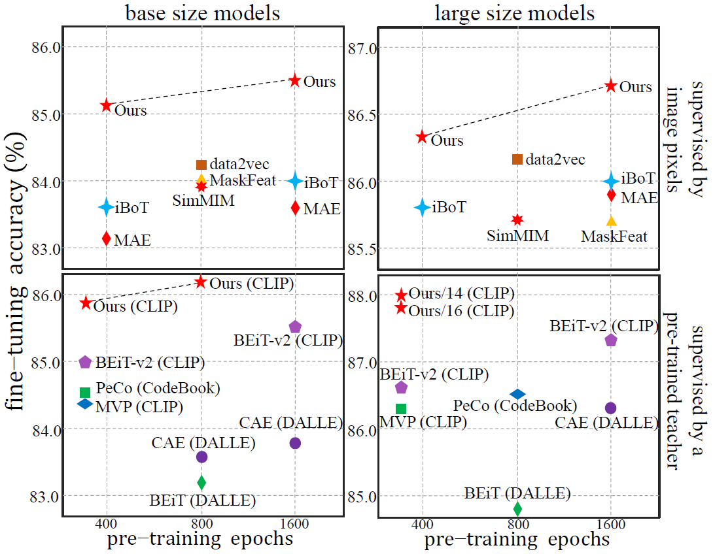
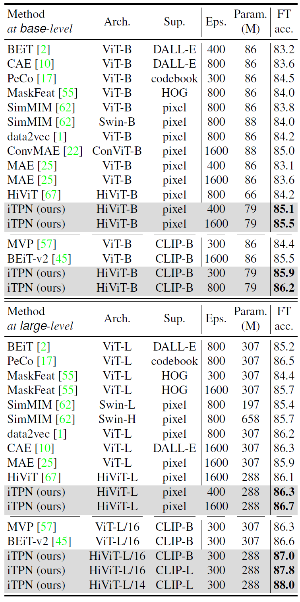
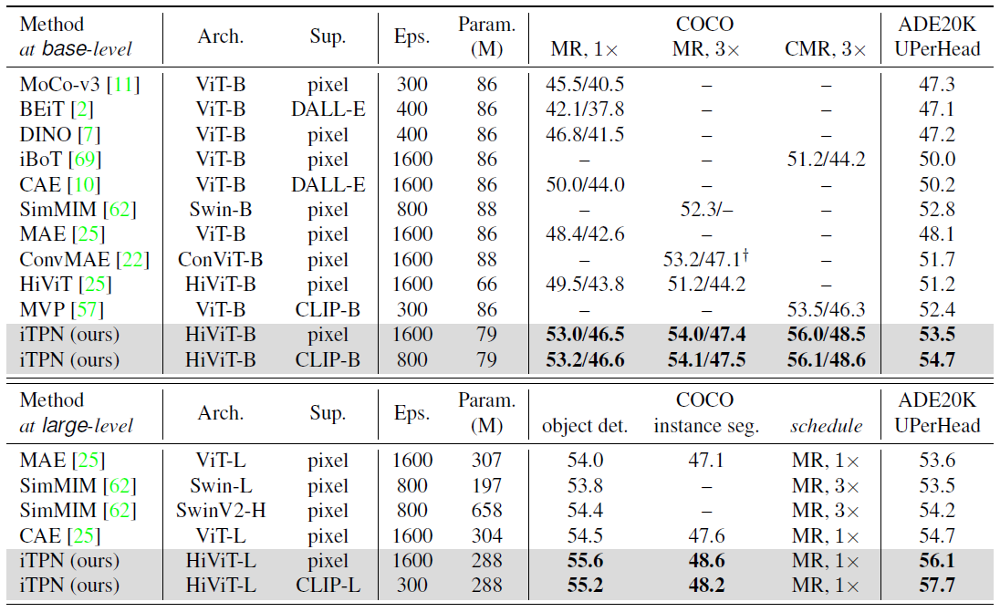

<div align="center">
<h1>iTPN</h1>
<h3>Integrally Pre-Trained Transformer Pyramid Networks</h3>

Yunjie Tian<sup>1</sup>,
[Lingxi Xie](https://scholar.google.com/citations?user=EEMm7hwAAAAJ&hl=zh-TW&oi=ao)<sup>2</sup>, 
Zhaozhi Wang<sup>1</sup>, 
[Longhui Wei](https://scholar.google.com/citations?user=thhnAhIAAAAJ&hl=zh-TW&oi=ao)<sup>2</sup>,
[Xiaopeng Zhang](https://scholar.google.com/citations?hl=zh-TW&user=Ud6aBAcAAAAJ)<sup>2</sup>,
[Jianbin Jiao](https://scholar.google.com/citations?hl=zh-TW&user=XqdpqNcAAAAJ)<sup>1</sup>,
[Yaowei Wang](https://scholar.google.com/citations?hl=zh-TW&user=o_DllmIAAAAJ)<sup>3</sup>,
[Qi Tian](https://scholar.google.com/citations?hl=zh-TW&user=61b6eYkAAAAJ)<sup>2</sup>,
[Qixiang Ye](https://scholar.google.com/citations?hl=zh-TW&user=tjEfgsEAAAAJ)<sup>1,3</sup>,

<sup>1</sup> [University of Chinese Academy of Sciences](https://www.ucas.ac.cn/), <sup>2</sup> [Huawei Inc.](https://www.huawei.com/cn/?utm_source=corp_bdpz&utm_campaign=regular&utm_medium=cpc), <sup>3</sup> [Pengcheng Lab.](https://www.pcl.ac.cn/).
  
This repo is an implementation of [Integrally Pre-Trained Transformer Pyramid Networks](https://arxiv.org/pdf/2211.12735.pdf). 

### This repo is being updated, and please stay tuned.

  
<p align="center">
  
</p>
<p align="center">
Figure 1: On ImageNet-1K classification, iTPN shows significant advantages over prior methods, either only using pixel supervision (top) or leveraging knowledge from a pre-trained teacher (bottom, in the parentheses lies the name of teacher model)
</p>

  
</div>
  
  
> **ImageNet Pre-training**: See [PRETRAIN.md](PRETRAIN.md).\
> **ImageNet Fine-tuning**: See [FINETUNE.md](FINETUNE.md).\
> **Object Detection**: See [DETECTION.md](object_detection/README.md).\
> **Semantic Segmentation**: See [SEGMENTATION.md](semantic_segmentation/README.md).


## Updates

***25/Nov./2022***

The preprint version is public at [arxiv](https://arxiv.org/pdf/2211.12735.pdf).


### Getting Started
## requiments
* Ubuntu
* Python 3.7+
* CUDA 10.2+
* GCC 5+
* Pytorch 1.7+
## Dataset
* ImageNet-1K
* COCO2017
* ADE20K

iTPN supports pre-training using pixel and CLIP as supervision. For the latter, please first download the [CLIP models](https://github.com/openai/CLIP/blob/main/clip/clip.py) (We use [CLIP-B/16](https://openaipublic.azureedge.net/clip/models/5806e77cd80f8b59890b7e101eabd078d9fb84e6937f9e85e4ecb61988df416f/ViT-B-16.pt) and [CLIP-L/14](https://openaipublic.azureedge.net/clip/models/b8cca3fd41ae0c99ba7e8951adf17d267cdb84cd88be6f7c2e0eca1737a03836/ViT-L-14.pt) models in the paper). See details at [PRETRAIN.md](PRETRAIN.md).


### Due to data privacy policy of Huawei Inc., the checkpoints are not availble temporarily. But we are applying for them and then release them recently.


<p align="center">
  
</p>
<p align="center">
Table 1: Top-1 classification accuracy (%) by fine-tuning the pre-trained models on ImageNet-1K. We compare models of different levels and supervisions (e.g., with and without CLIP) separately.
</p>

<p align="center">
  
</p>
<p align="center">
Table 2: Visual recognition results (%) on COCO and ADE20K. Mask R-CNN (abbr. MR, 1x/3x) and Cascade Mask R-CNN (abbr. CMR, 1x) are used on COCO, and UPerHead with 512x512 input is used on ADE20K. For the base-level models, each cell of COCO results contains object detection (box) and instance segmentation (mask) APs. For the large-level models, the accuracy of 1x Mask R-CNN surpasses all existing methods. 
</p>


## License
iTPN is released under the [MIT License](https://github.com/sunsmarterjie/iTPN/blob/main/LICENSE).

## Citation

```bash
@article{tian2022integrally,
  title={Integrally Pre-Trained Transformer Pyramid Networks},
  author={Tian, Yunjie and Xie, Lingxi and Wang, Zhaozhi and Wei, Longhui and Zhang, Xiaopeng and Jiao, Jianbin and Wang, Yaowei and Tian, Qi and Ye, Qixiang},
  journal={arXiv preprint arXiv:2211.12735},
  year={2022}
}
```

```bash
@article{zhang2022hivit,
  title={HiViT: Hierarchical Vision Transformer Meets Masked Image Modeling},
  author={Zhang, Xiaosong and Tian, Yunjie and Huang, Wei and Ye, Qixiang and Dai, Qi and Xie, Lingxi and Tian, Qi},
  journal={arXiv preprint arXiv:2205.14949},
  year={2022}
}
```
