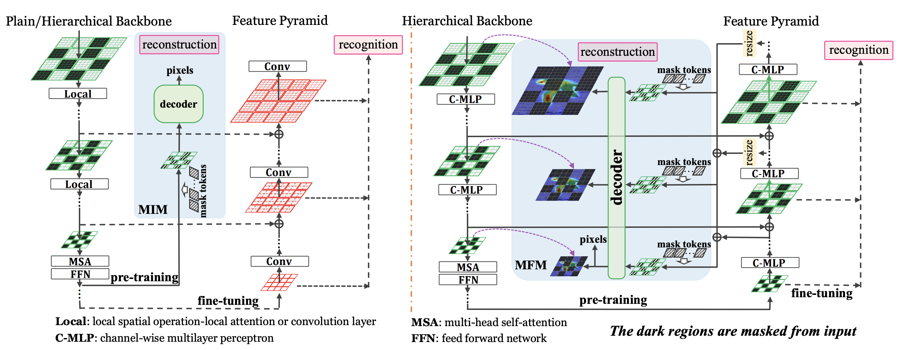

<div align="center">

## [CVPR2023] [Integrally Pre-Trained Transformer Pyramid Networks](https://openaccess.thecvf.com/content/CVPR2023/html/Tian_Integrally_Pre-Trained_Transformer_Pyramid_Networks_CVPR_2023_paper.html)

(Hierarchical Vision Transformer for Masked Image Modeling)
  
<p align="center">
  
</p>
<p align="center">
Figure 1: The comparison between a conventional pre-training (left) and the proposed integral pre-training framework (right). We use a
feature pyramid as the unified neck module and apply masked feature modeling for pre-training the feature pyramid. The green and red
blocks indicate that the network weights are pre-trained and un-trained (i.e., randomly initialized for fine-tuning), respectively.
</p>

  
</div>


## Updates

***26/Nov./2023***

| model | Para. (M) | Pre-train | teacher | input/patch | 21K ft? | Acc on IN.1K | checkpoint | checkpoint (21K)|
| :---: | :---: |:---: |:---: |:---: |:---: |
| Fast-iTPN-T| 24 |IN.1K |CLIP-L|224/16|N|**85.1%**| | |
| Fast-iTPN-T| 24 |IN.1K |CLIP-L|384/16|N|**86.2%**| | |
| Fast-iTPN-T| 24 |IN.1K |CLIP-L|512/16|N|**86.5%**| | |
| Fast-iTPN-S| 40 |IN.1K |CLIP-L|512/16|N|**88.5%**| | |
| Fast-iTPN-B| 85 | IN.1K |CLIP-L|512/16|Y|**88.7%**| | |
| Fast-iTPN-L| 312 |IN.1K |CLIP-L|512/16|Y|**88.7%**| | |

***30/May/2023***

| model | Pre-train | teacher | input/patch | 21K ft? | Acc on IN.1K |
| :---: | :---: |:---: |:---: |:---: |:---: |
|  EVA-02-B | IN.21K |EVA-CLIP-g|196/14|N|87.0%|
|  EVA-02-B | IN.21K |EVA-CLIP-g|448/14|N|88.3%|
|  EVA-02-B | IN.21K |EVA-CLIP-g|448/14|Y|88.6%|
| Fast-iTPN-B|IN.1K |CLIP-L|224/16|N|**87.4%**|
| Fast-iTPN-B|IN.1K |CLIP-L|512/16|N|**88.5%**|
| Fast-iTPN-B|IN.1K |CLIP-L|512/16|Y|**88.7%**|

All the models above are only pre-trained on ImageNet-1K and these models will be available soon.

***29/May/2023***

The iTPN-L-CLIP/16 intermediate fine-tuned model is available (password:itpn) [pretrained on 21K](https://pan.baidu.com/s/1JF0_PRLth4SkiOeSjiKk2Q?pwd=itpn), and [fine-tuned on 1K](https://pan.baidu.com/s/1TtV4kuW4nao7O1osNUxKhw?pwd=itpn). Evaluating the latter one on ImageNet-1K obtains **89.2%** accuracy.  

***28/Feb./2023***

**iTPN is accepted by CVPR2023!**

***08/Feb./2023***

The iTPN-L-CLIP/16 model reaches **89.2%** fine-tuning performance on ImageNet-1K.

configurations: intermediate fine-tuning on ImageNet-21K + 384 input size

***21/Jan./2023***

**Our HiViT is accepted by ICLR2023!**

[HiViT: A Simpler and More Efficient Design of Hierarchical Vision Transformer](https://openreview.net/forum?id=3F6I-0-57SC)

***08/Dec./2022***

Get checkpoints (password: abcd):
| |iTPN-B-pixel | iTPN-B-CLIP | iTPN-L-pixel | iTPN-L-CLIP/16|
| :---: | :---: |:---: |:---: |:---: |
|  baidu drive |[download](https://pan.baidu.com/s/1DjT2qtwGX5Kg1sU5kKlfEw)|[download](https://pan.baidu.com/s/1__LnTBBYzpvVEmGZFt7nFw)|[download](https://pan.baidu.com/s/1zy__QWtAhRyUHqKlTjKBGw)|[download](https://pan.baidu.com/s/1Gu-I3Z-25GFsfB31MQ_xZg)|
| google drive  |[download](https://drive.google.com/file/d/1TYCaepVflm0xMrQefG5Sj4ityXYbJLFt/view?usp=share_link)|[download](https://drive.google.com/file/d/1H51Zusrvlj8RjcWA7yuUyeqaVhmndSeN/view?usp=share_link)|[download](https://drive.google.com/file/d/1TYCaepVflm0xMrQefG5Sj4ityXYbJLFt/view?usp=share_link)|[download](https://drive.google.com/file/d/1gyyjcdMvAQsz2xC7ei-rEd7G4po2spy4/view?usp=share_link)|


***25/Nov./2022***

The preprint version is public at [arxiv](https://arxiv.org/pdf/2211.12735.pdf).


## Requiments
* Ubuntu
* Python 3.7+
* CUDA 10.2+
* GCC 5+
* Pytorch 1.7+
## Dataset
* ImageNet-1K
* COCO2017
* ADE20K


## Get Started

Prepare the environment:
```bash
conda create --name itpn python=3.8 -y
conda activate itpn

git clone git@github.com:sunsmarterjie/iTPN.git
cd iTPN

pip install torch==1.7.1+cu10.2 torchvision==0.8.2+cu10.2 timm==0.3.2 tensorboard einops
```

iTPN supports pre-training using pixel and CLIP as supervision. For the latter, please first download the [CLIP models](https://github.com/openai/CLIP/blob/main/clip/clip.py) (We use [CLIP-B/16](https://openaipublic.azureedge.net/clip/models/5806e77cd80f8b59890b7e101eabd078d9fb84e6937f9e85e4ecb61988df416f/ViT-B-16.pt) and [CLIP-L/14](https://openaipublic.azureedge.net/clip/models/b8cca3fd41ae0c99ba7e8951adf17d267cdb84cd88be6f7c2e0eca1737a03836/ViT-L-14.pt) models in the paper). 


## Main Results

<p align="center">
  
</p>
<p align="center">
Table 1: Top-1 classification accuracy (%) by fine-tuning the pre-trained models on ImageNet-1K. We compare models of different levels and supervisions (e.g., with and without CLIP) separately.
</p>

<p align="center">
  
</p>
<p align="center">
Table 2: Visual recognition results (%) on COCO and ADE20K. Mask R-CNN (abbr. MR, 1x/3x) and Cascade Mask R-CNN (abbr. CMR, 1x) are used on COCO, and UPerHead with 512x512 input is used on ADE20K. For the base-level models, each cell of COCO results contains object detection (box) and instance segmentation (mask) APs. For the large-level models, the accuracy of 1x Mask R-CNN surpasses all existing methods. 
</p>


## License
iTPN is released under the [License](https://github.com/sunsmarterjie/iTPN/blob/main/LICENSE).

*Your star is my motivation to update, thanks!*

## Citation

```bash
@inproceedings{tian2023integrally,
  title={Integrally Pre-Trained Transformer Pyramid Networks},
  author={Tian, Yunjie and Xie, Lingxi and Wang, Zhaozhi and Wei, Longhui and Zhang, Xiaopeng and Jiao, Jianbin and Wang, Yaowei and Tian, Qi and Ye, Qixiang},
  booktitle={Proceedings of the IEEE/CVF Conference on Computer Vision and Pattern Recognition},
  pages={18610--18620},
  year={2023}
}
```

```bash
@inproceedings{zhang2023hivit,
  title={HiViT: A Simpler and More Efficient Design of Hierarchical Vision Transformer},
  author={Zhang, Xiaosong and Tian, Yunjie and Xie, Lingxi and Huang, Wei and Dai, Qi and Ye, Qixiang and Tian, Qi},
  booktitle={International Conference on Learning Representations},
  year={2023}
}
```
