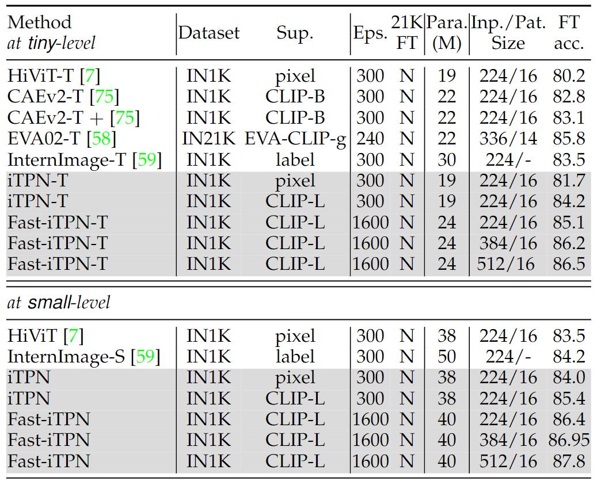

A Stronger Visual Foundation Model: [Fast-iTPN](https://arxiv.org/pdf/2211.12735.pdf).


## Download the pre-trained models below (without acceleration):

| model | Para. (M) | Pre-train | teacher | input/patch | 21K ft? | Acc on IN.1K | checkpoint | checkpoint (21K)|
| :---: | :---: |:---: |:---: |:---: |:---: | :---: | :---: | :---: |
| Fast-iTPN-T| 24 |IN.1K |CLIP-L|224/16|N|**85.1%**|[baidu](https://pan.baidu.com/s/1H6vYLmG2pUAvL7uD7plxTQ?pwd=itpn)/[google](https://drive.google.com/file/d/1Ze9RkJggxxi58Dl7sqWrf2TNOSnRK4Wi/view?usp=sharing) |  |
| Fast-iTPN-T| 24 |IN.1K |CLIP-L|384/16|N|**86.2%**|||
| Fast-iTPN-T| 24 |IN.1K |CLIP-L|512/16|N|**86.5%**|||
| Fast-iTPN-S| 40 |IN.1K |CLIP-L|224/16|N|**86.4%**|[baidu](https://pan.baidu.com/s/1aovyWpsQqB-V5M3OXoVCMA?pwd=itpn)/[google](https://drive.google.com/file/d/1Wvk5kQSh8fWQCUwzAp7eaVpmOi3D5_H4/view?usp=sharing) |  |
| Fast-iTPN-S| 40 |IN.1K |CLIP-L|384/16|N|**86.95%**| | |
| Fast-iTPN-S| 40 |IN.1K |CLIP-L|512/16|N|**87.8%**| | |
| Fast-iTPN-B| 85 | IN.1K |CLIP-L|224/16|N|**87.4%**|[baidu](https://pan.baidu.com/s/1R-FfMAx-wmIUSJR-JUVnVw?pwd=itpn)/[google](https://drive.google.com/file/d/1ADXPV95XpWb1ROMCih1n3AD52fGdr8C_/view?usp=sharing) |  |
| Fast-iTPN-B| 85 | IN.1K |CLIP-L|512/16|N|**88.5%**| | |
| Fast-iTPN-B| 85 | IN.1K |CLIP-L|512/16|Y|**88.75%**| | [baidu](https://pan.baidu.com/s/1kkX2E5Z4VwQ4joYvLyebnQ?pwd=itpn)/[google](https://drive.google.com/file/d/1ddGbBm46FiUdNs9HPSepokhuOKhEnBdV/view?usp=sharing) |
| Fast-iTPN-L| 312 |IN.1K |CLIP-L|640/16|N|**89.5%**|[baidu](https://pan.baidu.com/s/1wbnbBkjHIUgHS_1okxMHCg?pwd=itpn)/[google](https://drive.google.com/file/d/16uybbJ23Fp7lnGNYL5I198glHGhwn_y2/view?usp=sharing) | |

The Fast-iTPN series exclusively utilizes ImageNet-1K for training and, to the best of our knowledge, achieve superior performance in tiny/small/base-scale models.


## Main Results

<p align="left">
  
</p>
<p align="left">
Table 1: Fast_iTPN_tiny/small top-1 classification accuracy on ImageNet-1K.
</p>

<p align="left">
  
</p>
<p align="left">
Table 2: Fast_iTPN_base/large top-1 classification accuracy on ImageNet-1K.
</p>


## Fast_iTPN Fine-Tuning on ImageNet-1K: 
(Without acceleration)

<details>
 <summary> Fine-tune <b>Fast_iTPN_tiny</b>:</summary>

```bash    
NNODES=2
GPUS=8
CLASSES=1000
INPUT_SIZE=224  # 384/512
WEIGHT_DECAY=0.05
BATCH_SIZE=64
LAYER_SCALE_INIT_VALUE=0.1
LR=1e-4
UPDATE_FREQ=1
REPROB=0.25
EPOCHS=100
W_EPOCHS=5
LAYER_DECAY=0.80
MIN_LR=1e-6
WARMUP_LR=1e-6
DROP_PATH=0.1
MIXUP=0.8
CUTMIX=1.0
SMOOTHING=0.1
MODEL='fast_itpn_tiny_1112_patch16_224'
WEIGHT='../fast_itpn_tiny_1600e_1k.pt'
NODE_RANK=your_node_rank
MASTER_ADDR=your_master_addr

python -m torch.distributed.launch \
    --nproc_per_node ${GPUS} \
    --nnodes=${NNODES} \
    --node_rank=${NODE_RANK} \
    --master_addr=${MASTER_ADDR} \
    --master_port=6666 \
    run_class_finetuning.py  \
    --data_path /PATH/TO/IN1K/train \
    --eval_data_path /PATH/TO/IN1K/val \
    --nb_classes ${CLASSES} \
    --data_set image_folder \
    --output_dir ./output \
    --input_size ${INPUT_SIZE} \
    --log_dir ./output \
    --model ${MODEL} \
    --weight_decay ${WEIGHT_DECAY}  \
    --finetune ${WEIGHT}  \
    --batch_size ${BATCH_SIZE}  \
    --layer_scale_init_value ${LAYER_SCALE_INIT_VALUE} \
    --lr ${LR} \
    --update_freq ${UPDATE_FREQ}  \
    --reprob ${REPROB} \
    --warmup_epochs ${W_EPOCHS} \
    --epochs ${EPOCHS}  \
    --layer_decay ${LAYER_DECAY} \
    --min_lr ${MIN_LR} \
    --warmup_lr ${WARMUP_LR} \
    --drop_path ${DROP_PATH}  \
    --mixup ${MIXUP} \
    --cutmix ${CUTMIX} \
    --smoothing ${SMOOTHING} \
    --imagenet_default_mean_and_std   \
    --dist_eval \
    --model_ema \
    --model_ema_eval \
    --save_ckpt_freq 20 \
```
</details>


<details>
 <summary> Fine-tune <b>Fast_iTPN_small</b>:</summary>


```bash    
NNODES=2
GPUS=8
CLASSES=1000
INPUT_SIZE=224  # 384/512
WEIGHT_DECAY=0.05
BATCH_SIZE=64
LAYER_SCALE_INIT_VALUE=0.1
LR=1e-4
UPDATE_FREQ=1
REPROB=0.25
EPOCHS=100
W_EPOCHS=5
LAYER_DECAY=0.90
MIN_LR=1e-6
WARMUP_LR=1e-6
DROP_PATH=0.1
MIXUP=0.8
CUTMIX=1.0
SMOOTHING=0.1
MODEL='fast_itpn_small_2220_patch16_224'
WEIGHT='../fast_itpn_small_1600e_1k.pt'
NODE_RANK=your_node_rank
MASTER_ADDR=your_master_addr

python -m torch.distributed.launch \
    --nproc_per_node ${GPUS} \
    --nnodes=${NNODES} \
    --node_rank=${NODE_RANK} \
    --master_addr=${MASTER_ADDR} \
    --master_port=6666 \
    run_class_finetuning.py  \
    --data_path /PATH/TO/IN1K/train \
    --eval_data_path /PATH/TO/IN1K/val \
    --nb_classes ${CLASSES} \
    --data_set image_folder \
    --output_dir ./output \
    --input_size ${INPUT_SIZE} \
    --log_dir ./output \
    --model ${MODEL} \
    --weight_decay {WEIGHT_DECAY}  \
    --finetune ${WEIGHT}  \
    --batch_size ${BATCH_SIZE}  \
    --layer_scale_init_value ${LAYER_SCALE_INIT_VALUE} \
    --lr {LR} \
    --update_freq ${UPDATE_FREQ}  \
    --reprob ${REPROB} \
    --warmup_epochs ${W_EPOCHS} \
    --epochs ${EPOCHS}  \
    --layer_decay ${LAYER_DECAY} \
    --min_lr ${MIN_LR} \
    --warmup_lr ${WARMUP_LR} \
    --drop_path ${DROP_PATH}  \
    --mixup ${MIXUP} \
    --cutmix ${CUTMIX} \
    --smoothing ${SMOOTHING} \
    --imagenet_default_mean_and_std   \
    --dist_eval \
    --model_ema \
    --model_ema_eval \
    --save_ckpt_freq 20 \
```
</details>


<details>
 <summary> Fine-tune <b>Fast_iTPN_base</b>:</summary>


```bash    
NNODES=4
GPUS=8
CLASSES=1000
INPUT_SIZE=224  # 512
WEIGHT_DECAY=0.05
BATCH_SIZE=32
LAYER_SCALE_INIT_VALUE=0.1
LR=1e-4
UPDATE_FREQ=1
REPROB=0.25
EPOCHS=20
W_EPOCHS=3
LAYER_DECAY=0.90
MIN_LR=1e-6
WARMUP_LR=1e-6
DROP_PATH=0.1
MIXUP=0.8
CUTMIX=1.0
SMOOTHING=0.1
MODEL='fast_itpn_base_3324_patch16_224'
WEIGHT='../fast_itpn_base_clipl_e1600.pt'  
NODE_RANK=your_node_rank
MASTER_ADDR=your_master_addr

python -m torch.distributed.launch \
    --nproc_per_node ${GPUS} \
    --nnodes=${NNODES} \
    --node_rank=${NODE_RANK} \
    --master_addr=${MASTER_ADDR} \
    --master_port=6666 \
    run_class_finetuning.py  \
    --data_path /PATH/TO/IN1K/train \
    --eval_data_path /PATH/TO/IN1K/val \
    --nb_classes ${CLASSES} \
    --data_set image_folder \
    --output_dir ./output \
    --input_size ${INPUT_SIZE} \
    --log_dir ./output \
    --model ${MODEL} \
    --weight_decay ${WEIGHT_DECAY}  \
    --finetune ${WEIGHT}  \
    --batch_size ${BATCH_SIZE}  \
    --layer_scale_init_value ${LAYER_SCALE_INIT_VALUE} \
    --lr ${LR} \
    --update_freq ${UPDATE_FREQ}  \
    --reprob ${REPROB} \
    --warmup_epochs ${W_EPOCHS} \
    --epochs ${EPOCHS}  \
    --layer_decay ${LAYER_DECAY} \
    --min_lr ${MIN_LR} \
    --warmup_lr ${WARMUP_LR} \
    --drop_path ${DROP_PATH}  \
    --mixup ${MIXUP} \
    --cutmix ${CUTMIX} \
    --smoothing ${SMOOTHING} \
    --imagenet_default_mean_and_std   \
    --dist_eval \
    --model_ema \
    --model_ema_eval \
    --save_ckpt_freq 20 \
```
</details>


<details>
 <summary> Fine-tune <b>Fast_iTPN_large</b>:</summary>


```bash    
NNODES=4
GPUS=8
CLASSES=1000
INPUT_SIZE=640
WEIGHT_DECAY=0.05
BATCH_SIZE=4
LAYER_SCALE_INIT_VALUE=0.1
LR=5e-5
UPDATE_FREQ=4
REPROB=0.25
EPOCHS=20
W_EPOCHS=3
LAYER_DECAY=0.95
MIN_LR=1e-6
WARMUP_LR=1e-6
DROP_PATH=0.2
MIXUP=0.8
CUTMIX=1.0
SMOOTHING=0.1
MODEL='fast_itpn_large_2240_patch16_256'
WEIGHT='../fast_itpn_large_1600e_1k.pt'  
NODE_RANK=your_node_rank
MASTER_ADDR=your_master_addr

python -m torch.distributed.launch \
    --nproc_per_node ${GPUS} \
    --nnodes=${NNODES} \
    --node_rank=${NODE_RANK} \
    --master_addr=${MASTER_ADDR} \
    --master_port=6666 \
    run_class_finetuning.py  \
    --data_path /PATH/TO/IN1K/train \
    --eval_data_path /PATH/TO/IN1K/val \
    --nb_classes ${CLASSES} \
    --data_set image_folder \
    --output_dir ./output \
    --input_size ${INPUT_SIZE} \
    --log_dir ./output \
    --model ${MODEL} \
    --weight_decay ${WEIGHT_DECAY}  \
    --finetune ${WEIGHT}  \
    --batch_size ${BATCH_SIZE}  \
    --layer_scale_init_value ${LAYER_SCALE_INIT_VALUE} \
    --lr ${LR} \
    --update_freq ${UPDATE_FREQ}  \
    --reprob ${REPROB} \
    --warmup_epochs ${W_EPOCHS} \
    --epochs ${EPOCHS}  \
    --layer_decay ${LAYER_DECAY} \
    --min_lr ${MIN_LR} \
    --warmup_lr ${WARMUP_LR} \
    --drop_path ${DROP_PATH}  \
    --mixup ${MIXUP} \
    --cutmix ${CUTMIX} \
    --smoothing ${SMOOTHING} \
    --imagenet_default_mean_and_std   \
    --dist_eval \
    --model_ema \
    --model_ema_eval \
    --save_ckpt_freq 20 \
```
</details>

